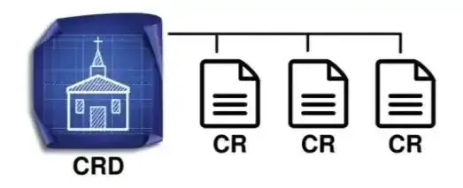
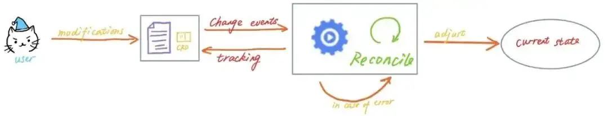

# 很火的 K8s Operator 是啥？带你开发一个Demo就明白了！

你也许能够将应用熟练的部署到 Kubernetes 上，但你知道什么是 Operator 吗？Operator 是如何工作的？如何构建 Operator？这是一个复杂的课题，但幸运的是，自 2016 年发明以来，已经开发了许多相关工具，可以简化工程师的生活。

这些工具允许我们将自定义逻辑加入 Kubernetes，从而自动化大量任务，而这已经超出了软件本身功能的范围。

闲话少说，让我们深入了解更多关于 Operator 的知识吧！

## 什么是 Operator？

等一下，你知道 Kubernetes（或 k8s）吗？简单介绍一下，这是由谷歌云开发的“可以在任何地方部署、扩展和管理容器应用程序的开源系统”。

大多数人使用 Kubernetes 的方式是使用原生资源（如 Pod、Deployment、Service 等）部署应用程序。但是，也可以扩展 Kubernetes 的功能，从而添加满足特定需求的新业务逻辑，这就是 Operator 的作用。Operator 的主要目标是将工程师的逻辑转换为代码，以便实现原生 Kubernetes 无法完成的某些任务的自动化。

负责开发应用程序或服务的工程师对系统应该如何运行、如何部署以及如何在出现问题时做出反应有很深的了解。将这些技术知识封装在代码中并自动化操作的能力意味着在可以花费更少的时间处理重复任务，而在重要问题上可以投入更多时间。

例如，可以想象 Operator 在 Kubernetes 中部署和维护 MySQL、Elasticsearch 或 Gitlab runner 等工具，Operator 可以配置这些工具，根据事件调整系统状态，并对故障做出反应。

听起来很有趣不是吗？让我们动手干吧。

## 构建 Operator

可以使用 Kubernetes 开发的 controller-runtime 项目从头构建 Operator，也可以使用最流行的框架之一加速开发周期并降低复杂性（Kubebuilder 或 OperatorSDK）。因为 Kubebuilder 框架非常容易使用，文档也很容易阅读，而且久经考验，因此我选择基于 Kubebuilder 构建。

不管怎样，这两个项目目前正在合并为单独的项目。

### **「设置开发环境」**

开发 Operator 需要以下必备工具：

- Go v1.17.9+
- Docker 17.03+
- kubectl v1.11.3+
- 访问 Kubernetes v1.11.3+集群（强烈建议使用 kind 设置自己的本地集群，它非常容易使用！）

然后安装 kubebuilder：

```text
$ curl -L -o kubebuilder https://go.kubebuilder.io/dl/latest/$(go env GOOS)/$(go env GOARCH) && chmod +x kubebuilder && mv kubebuilder /usr/local/bin/
```

如果一切正常，应该会看到类似输出（版本可能会随时间发生变化）：

```text
$ kubebuilder version
Version: main.version{KubeBuilderVersion:"3.4.1", KubernetesVendor:"1.23.5", GitCommit:"d59d7882ce95ce5de10238e135ddff31d8ede026", BuildDate:"2022-05-06T13:58:56Z", GoOs:"darwin", GoArch:"amd64"}
```

太棒了，现在可以开始了!

### **「构建简单的 Operator」**

接下来做个小练习，构建一个简单的 foo operator，除了演示 Operator 的功能之外，没有实际用处。运行以下命令初始化新项目，该命令将下载 controller-runtime 二进制文件，并为我们准备好项目。

```text
$ kubebuilder init --domain my.domain --repo my.domain/tutorial
Writing kustomize manifests for you to edit...
Writing scaffold for you to edit...
Get controller runtime:
$ go get sigs.k8s.io/controller-runtime@v0.11.2
go: downloading sigs.k8s.io/controller-runtime v0.11.2
...
Update dependencies:
$ go mod tidy
go: downloading github.com/onsi/gomega v1.17.0
...
```

下面是项目结构（注意这是一个 Go 项目）：

```text
$ ls -a
-rw-------   1 leovct  staff    129 Jun 30 16:08 .dockerignore
-rw-------   1 leovct  staff    367 Jun 30 16:08 .gitignore
-rw-------   1 leovct  staff    776 Jun 30 16:08 Dockerfile
-rw-------   1 leovct  staff   5029 Jun 30 16:08 Makefile
-rw-------   1 leovct  staff    104 Jun 30 16:08 PROJECT
-rw-------   1 leovct  staff   2718 Jun 30 16:08 README.md
drwx------   6 leovct  staff    192 Jun 30 16:08 config
-rw-------   1 leovct  staff   3218 Jun 30 16:08 go.mod
-rw-r--r--   1 leovct  staff  94801 Jun 30 16:08 go.sum
drwx------   3 leovct  staff     96 Jun 30 16:08 hack
-rw-------   1 leovct  staff   2780 Jun 30 16:08 main.go
```

我们来看看这个 Operator 最重要的组成部分：

- main.go 是项目入口，负责设置并运行管理器。
- config/包含在 Kubernetes 中部署 Operator 的 manifest。
- Dockerfile 是用于构建管理器镜像的容器文件。

等等，这个管理器组件是什么玩意儿？

这涉及到部分理论知识，我们稍后再说！

Operator 由两个组件组成，自定义资源定义（CRD，Custom Resource Definition）和控制器（Controller）。

CRD 是“Kubernetes 自定义类型”或资源蓝图，用于描述其规范和状态。我们可以定义 CRD 的实例，称为自定义资源（CR，Custom Resource）。



控制器（也称为控制循环）持续监视集群状态，并根据事件做出变更，目标是将资源的当前状态变为用户在自定义资源规范中定义的期望状态。



一般来说，控制器是特定于某种类型的资源的，但也可以对一组不同的资源执行 CRUD（创建、读取、更新和删除）操作。

在 Kubernetes 的文档中举了一个控制器的例子：恒温器。当我们设置温度时，告诉恒温器所需的状态，房间的实际温度就是当前的实际状态，恒温器通过打开或关闭空调，使实际状态更接近预期状态。

那管理器（manager）呢？该组件的目标是启动所有控制器，并使控制循环共存。假设项目中有两个 CRD，同时有两个控制器，每个 CRD 对应一个控制器，管理器将启动这两个控制器并使它们共存。

现在我们知道了 Operator 是如何工作的，可以开始使用 Kubebuilder 框架创建一个 Operator，我们从创建新的 API（组/版本）和新的 Kind（CRD）开始，当提示创建 CRD 和控制器时，按 yes。

```text
$ kubebuilder create api --group tutorial --version v1 --kind Foo
Create Resource [y/n] y
Create Controller [y/n] y
Writing kustomize manifests for you to edit...
Writing scaffold for you to edit...
api/v1/foo_types.go
controllers/foo_controller.go
Update dependencies:
$ go mod tidy
Running make:
$ make generate
mkdir -p /Users/leovct/Documents/tutorial/bin
GOBIN=/Users/leovct/Documents/tutorial/bin go install sigs.k8s.io/controller-tools/cmd/controller-gen@v0.8.0
/Users/leovct/Documents/tutorial/bin/controller-gen object:headerFile="hack/boilerplate.go.txt" paths="./..."
```

接下来是最有意思的部分！我们将定制 CRD 和控制器来满足需求，注意看已经创建了两个新文件夹：

- api/v1 包含 Foo CRD
- controllers 包含 Foo 控制器

### **「自定义 CRD 和 Controller」**

接下来定制我们可爱的 Foo CRD。正如前面所说，这个 CRD 没有任何目的，只是简单展示如何使用 Operator 在 Kubernetes 中执行简单的任务。

Foo CRD 在其定义中有 name 字段，该字段指的是 Foo 正在寻找的朋友的名称。如果 Foo 找到了一个朋友（一个和朋友同名的 Pod），happy 状态将被设置为 true。

```text
package v1

import (
 metav1 "k8s.io/apimachinery/pkg/apis/meta/v1"
)

// FooSpec defines the desired state of Foo
type FooSpec struct {
 // Name of the friend Foo is looking for
 Name string `json:"name"`
}

// FooStatus defines the observed state of Foo
type FooStatus struct {
 // Happy will be set to true if Foo found a friend
 Happy bool `json:"happy,omitempty"`
}

//+kubebuilder:object:root=true
//+kubebuilder:subresource:status

// Foo is the Schema for the foos API
type Foo struct {
 metav1.TypeMeta   `json:",inline"`
 metav1.ObjectMeta `json:"metadata,omitempty"`

 Spec   FooSpec   `json:"spec,omitempty"`
 Status FooStatus `json:"status,omitempty"`
}

//+kubebuilder:object:root=true

// FooList contains a list of Foo
type FooList struct {
 metav1.TypeMeta `json:",inline"`
 metav1.ListMeta `json:"metadata,omitempty"`
 Items           []Foo `json:"items"`
}

func init() {
 SchemeBuilder.Register(&Foo{}, &FooList{})
}
```

接下来实现控制器逻辑。没什么复杂的，通过触发 reconciliation 请求获取 Foo 资源，从而得到 Foo 的朋友的名称。然后，列出所有和 Foo 的朋友同名的 Pod。如果找到一个或多个，将 Foo 的 happy 状态更新为 true，否则设置为 false。

注意，控制器也会对 Pod 事件做出反应。实际上，如果创建了一个新的 Pod，我们希望 Foo 资源能够相应更新其状态。这个方法将在每次发生 Pod 事件时被触发（创建、更新或删除）。然后，只有当 Pod 名称是集群中部署的某个 Foo 自定义资源的“朋友”时，才触发 Foo 控制器的 reconciliation 循环。

```text
package controllers

import (
 "context"

 corev1 "k8s.io/api/core/v1"
 "k8s.io/apimachinery/pkg/runtime"
 "k8s.io/apimachinery/pkg/types"
 ctrl "sigs.k8s.io/controller-runtime"
 "sigs.k8s.io/controller-runtime/pkg/client"
 "sigs.k8s.io/controller-runtime/pkg/handler"
 "sigs.k8s.io/controller-runtime/pkg/log"
 "sigs.k8s.io/controller-runtime/pkg/reconcile"
 "sigs.k8s.io/controller-runtime/pkg/source"

 tutorialv1 "my.domain/tutorial/api/v1"
)

// FooReconciler reconciles a Foo object
type FooReconciler struct {
 client.Client
 Scheme *runtime.Scheme
}

// RBAC permissions to monitor foo custom resources
//+kubebuilder:rbac:groups=tutorial.my.domain,resources=foos,verbs=get;list;watch;create;update;patch;delete
//+kubebuilder:rbac:groups=tutorial.my.domain,resources=foos/status,verbs=get;update;patch
//+kubebuilder:rbac:groups=tutorial.my.domain,resources=foos/finalizers,verbs=update

// RBAC permissions to monitor pods
//+kubebuilder:rbac:groups="",resources=pods,verbs=get;list;watch

// Reconcile is part of the main kubernetes reconciliation loop which aims to
// move the current state of the cluster closer to the desired state.
func (r *FooReconciler) Reconcile(ctx context.Context, req ctrl.Request) (ctrl.Result, error) {
 log := log.FromContext(ctx)
 log.Info("reconciling foo custom resource")

 // Get the Foo resource that triggered the reconciliation request
 var foo tutorialv1.Foo
 if err := r.Get(ctx, req.NamespacedName, &foo); err != nil {
  log.Error(err, "unable to fetch Foo")
  return ctrl.Result{}, client.IgnoreNotFound(err)
 }

 // Get pods with the same name as Foo's friend
 var podList corev1.PodList
 var friendFound bool
 if err := r.List(ctx, &podList); err != nil {
  log.Error(err, "unable to list pods")
 } else {
  for _, item := range podList.Items {
   if item.GetName() == foo.Spec.Name {
    log.Info("pod linked to a foo custom resource found", "name", item.GetName())
    friendFound = true
   }
  }
 }

 // Update Foo' happy status
 foo.Status.Happy = friendFound
 if err := r.Status().Update(ctx, &foo); err != nil {
  log.Error(err, "unable to update foo's happy status", "status", friendFound)
  return ctrl.Result{}, err
 }
 log.Info("foo's happy status updated", "status", friendFound)

 log.Info("foo custom resource reconciled")
 return ctrl.Result{}, nil
}

// SetupWithManager sets up the controller with the Manager.
func (r *FooReconciler) SetupWithManager(mgr ctrl.Manager) error {
 return ctrl.NewControllerManagedBy(mgr).
  For(&tutorialv1.Foo{}).
  Watches(
   &source.Kind{Type: &corev1.Pod{}},
   handler.EnqueueRequestsFromMapFunc(r.mapPodsReqToFooReq),
  ).
  Complete(r)
}

func (r *FooReconciler) mapPodsReqToFooReq(obj client.Object) []reconcile.Request {
 ctx := context.Background()
 log := log.FromContext(ctx)

 // List all the Foo custom resource
 req := []reconcile.Request{}
 var list tutorialv1.FooList
 if err := r.Client.List(context.TODO(), &list); err != nil {
  log.Error(err, "unable to list foo custom resources")
 } else {
  // Only keep Foo custom resources related to the Pod that triggered the reconciliation request
  for _, item := range list.Items {
   if item.Spec.Name == obj.GetName() {
    req = append(req, reconcile.Request{
     NamespacedName: types.NamespacedName{Name: item.Name, Namespace: item.Namespace},
    })
    log.Info("pod linked to a foo custom resource issued an event", "name", obj.GetName())
   }
  }
 }
 return req
}
```

我们已经完成了对 API 定义和控制器的编辑，可以运行以下命令来更新 Operator manifest。

```text
$ make manifests
/Users/leovct/Documents/tutorial/bin/controller-gen rbac:roleName=manager-role crd webhook paths="./..." output:crd:artifacts:config=config/crd/bases
```

### **「运行 Controller」**

我们使用 Kind 设置本地 Kubernetes 集群，它很容易使用。

首先将 CRD 安装到集群中。

```text
$ make install
/Users/leovct/Documents/tutorial/bin/controller-gen rbac:roleName=manager-role crd webhook paths="./..." output:crd:artifacts:config=config/crd/bases
kubectl apply -k config/crd
customresourcedefinition.apiextensions.k8s.io/foos.tutorial.my.domain created
```

可以看到 Foo CRD 已经创建好了。

```text
$ kubectl get crds
NAME                               CREATED AT
foos.tutorial.my.domain            2022-06-30T17:02:45Z
```

然后终端中运行控制器。请记住，也可以将其部署为 Kubernetes 集群中的 deployment。

```text
$ make run
/Users/leovct/Documents/tutorial/bin/controller-gen rbac:roleName=manager-role crd webhook paths="./..." output:crd:artifacts:config=config/crd/bases
/Users/leovct/Documents/tutorial/bin/controller-gen object:headerFile="hack/boilerplate.go.txt" paths="./..."
go fmt ./...
go vet ./...
go run ./main.go
INFO controller-runtime.metrics Metrics server is starting to listen {"addr": ":8080"}
INFO setup starting manager
INFO Starting server {"path": "/metrics", "kind": "metrics", "addr": "[::]:8080"}
INFO Starting server {"kind": "health probe", "addr": "[::]:8081"}
INFO controller.foo Starting EventSource {"reconciler group": "tutorial.my.domain", "reconciler kind": "Foo", "source": "kind source: *v1.Foo"}
INFO controller.foo Starting EventSource {"reconciler group": "tutorial.my.domain", "reconciler kind": "Foo", "source": "kind source: *v1.Pod"}
INFO controller.foo Starting Controller {"reconciler group": "tutorial.my.domain", "reconciler kind": "Foo"}
INFO controller.foo Starting workers {"reconciler group": "tutorial.my.domain", "reconciler kind": "Foo", "worker count": 1}
```

如你所见，管理器启动了，然后 Foo 控制器也启动了，控制器现在正在运行并监听事件！

### **「测试控制器」**

为了测试是否一切工作正常，我们创建两个 Foo 自定义资源以及一些 pod，观察控制器的行为。

首先，在 config/samples 中创建 Foo 自定义资源清单，运行以下命令在本地 Kubernetes 集群中创建资源。

```text
apiVersion: tutorial.my.domain/v1
kind: Foo
metadata:
  name: foo-01
spec:
  name: jack

---
apiVersion: tutorial.my.domain/v1
kind: Foo
metadata:
  name: foo-02
spec:
  name: joe
$ kubectl apply -f config/samples
foo.tutorial.my.domain/foo-1 created
foo.tutorial.my.domain/foo-2 created
```

可以看到控制器为每个 Foo 自定义资源创建事件触发了 reconciliation 循环。

```text
INFO controller.foo reconciling foo custom resource {"reconciler group": "tutorial.my.domain", "reconciler kind": "Foo", "name": "foo-1", "namespace": "default"}
INFO controller.foo foo's happy status updated {"reconciler group": "tutorial.my.domain", "reconciler kind": "Foo", "name": "foo-1", "namespace": "default", "status": "false"}
INFO controller.foo foo custom resource reconciled {"reconciler group": "tutorial.my.domain", "reconciler kind": "Foo", "name": "foo-1", "namespace": "default"}
INFO controller.foo reconciling foo custom resource {"reconciler group": "tutorial.my.domain", "reconciler kind": "Foo", "name": "foo-2", "namespace": "default"}
INFO controller.foo foo's happy status updated {"reconciler group": "tutorial.my.domain", "reconciler kind": "Foo", "name": "foo-2", "namespace": "default", "status": "false"}
INFO controller.foo foo custom resource reconciled {"reconciler group": "tutorial.my.domain", "reconciler kind": "Foo", "name": "foo-2", "namespace": "default"}
```

如果检查 Foo 自定义资源状态，可以看到状态为空，这正是所期望的，目前为止一切正常！

```text
$ kubectl describe foos
Name:         foo-1
Namespace:    default
API Version:  tutorial.my.domain/v1
Kind:         Foo
Metadata:     ...
Spec:
  Name:       jack
Status:
Name:         foo-2
Namespace:    default
API Version:  tutorial.my.domain/v1
Kind:         Foo
Metadata:     ...
Spec:
  Name:       joe
Status:
```

接下来我们部署一个叫 jack 的 Pod 来观察系统的反应。

```text
apiVersion: v1
kind: Pod
metadata:
  name: jack
spec:
  containers:
  - name: ubuntu
    image: ubuntu:latest
    # Just sleep forever
    command: [ "sleep" ]
    args: [ "infinity" ]
```

Pod 部署完成后，应该可以看到控制器对 Pod 创建事件作出响应，然后按照预期更新第一个 Foo 自定义资源状态，可以通过 describe Foo 自定义资源来验证。

```text
INFO pod linked to a foo custom resource issued an event {"name": "jack"}
INFO controller.foo reconciling foo custom resource {"reconciler group": "tutorial.my.domain", "reconciler kind": "Foo", "name": "foo-1", "namespace": "default"}
INFO controller.foo pod linked to a foo custom resource found {"reconciler group": "tutorial.my.domain", "reconciler kind": "Foo", "name": "foo-1", "namespace": "default", "name": "jack"}
INFO controller.foo foo's happy status updated {"reconciler group": "tutorial.my.domain", "reconciler kind": "Foo", "name": "foo-1", "namespace": "default", "status": true}
INFO controller.foo foo custom resource reconciled {"reconciler group": "tutorial.my.domain", "reconciler kind": "Foo", "name": "foo-1", "namespace": "default"}
```

我们更新第二个 Foo 自定义资源规范，将其 name 字段的值从 joe 更改为 jack，控制器应该捕获更新事件并触发 reconciliation 循环。

```text
INFO controller.foo pod linked to a foo custom resource found {"reconciler group": "tutorial.my.domain", "reconciler kind": "Foo", "name": "foo-2", "namespace": "default", "name": "jack"}
INFO controller.foo foo's happy status updated {"reconciler group": "tutorial.my.domain", "reconciler kind": "Foo", "name": "foo-2", "namespace": "default", "status": true}
INFO controller.foo foo custom resource reconciled {"reconciler group": "tutorial.my.domain", "reconciler kind": "Foo", "name": "foo-2", "namespace": "default"}
```

Yeah，成功了！我们已经做了足够多的实验，你应该明白这是怎么回事了！如果删除名为 jack 的 pod，自定义资源的 happy 状态将被设置为 false。

我们可以确认 Operator 是正常工作的！最好再编写一些单元测试和端到端测试，但本文不会覆盖相关内容。

为自己感到骄傲吧，你已经设计、部署并测试了第一个 Operator！恭喜！！

## 更多工作

我们已经看到如何创建非常基本的 Kubernetes operator，但远非完美，还有很多地方需要改善，下面是可以探索的主题列表：

- 优化事件过滤（有时，事件会被提交两次……）。
- 完善 RBAC 权限。
- 改进日志记录系统。
- 当 operator 更新资源时，触发 Kubernetes 事件。
- 获取 Foo 自定义资源时添加自定义字段（也许显示 happy 状态？）
- 编写单元测试和端到端测试。

通过这个列表，可以深入挖掘这一主题。